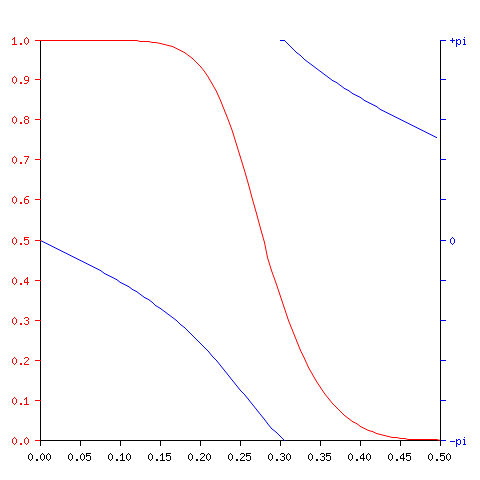

# Mkfilter

This is the mkfilter code from
https://github.com/university-of-york/cs-www-users-fisher slightly
hacked so it will compile with the more pernickety up to date Gnu C++
compiler and produce `.png` plot files.

## Examples

    mkfilter -Bu -Lp -o 4 -a 0.2
Generate a 4-pole Butterworth lowpass filter with corner frequency 0.2 fs;
display pole & zero positions and filter recurrence relation

    mkfilter -Bu -Lp -o 4 -a 0.2 -l | gencode
Generate C code for the above filter

```c
/* Digital filter designed by mkfilter/mkshape/gencode   A.J. Fisher
   Command line: ./mkfilter -Bu -Lp -o 4 -a 0.2 -l */

#define NZEROS 4
#define NPOLES 4
#define GAIN   2.146710182e+01

static float xv[NZEROS+1], yv[NPOLES+1];

static void filterloop()
  { for (;;)
      { xv[0] = xv[1]; xv[1] = xv[2]; xv[2] = xv[3]; xv[3] = xv[4];
        xv[4] = `next input value' / GAIN;
        yv[0] = yv[1]; yv[1] = yv[2]; yv[2] = yv[3]; yv[3] = yv[4];
        yv[4] =   (xv[0] + xv[4]) + 4 * (xv[1] + xv[3]) + 6 * xv[2]
                     + ( -0.0301188750 * yv[0]) + (  0.1826756978 * yv[1])
                     + ( -0.6799785269 * yv[2]) + (  0.7820951980 * yv[3]);
        `next output value' = yv[4];
      }
  }
```

    mkfilter -Bu -Lp -o 4 -a 0.2 -l | genplot graph.png
Generate phase & magnitude graphs for the above filter



    mkfilter -Re 1000 -Bp -a 0.3
Generate a bandpass resonator with Q = 1000 and centre frequency 0.3 fs;
display pole & zero positions and filter recurrence relation

See [doc.pdf](doc.pdf) for original documentation.
